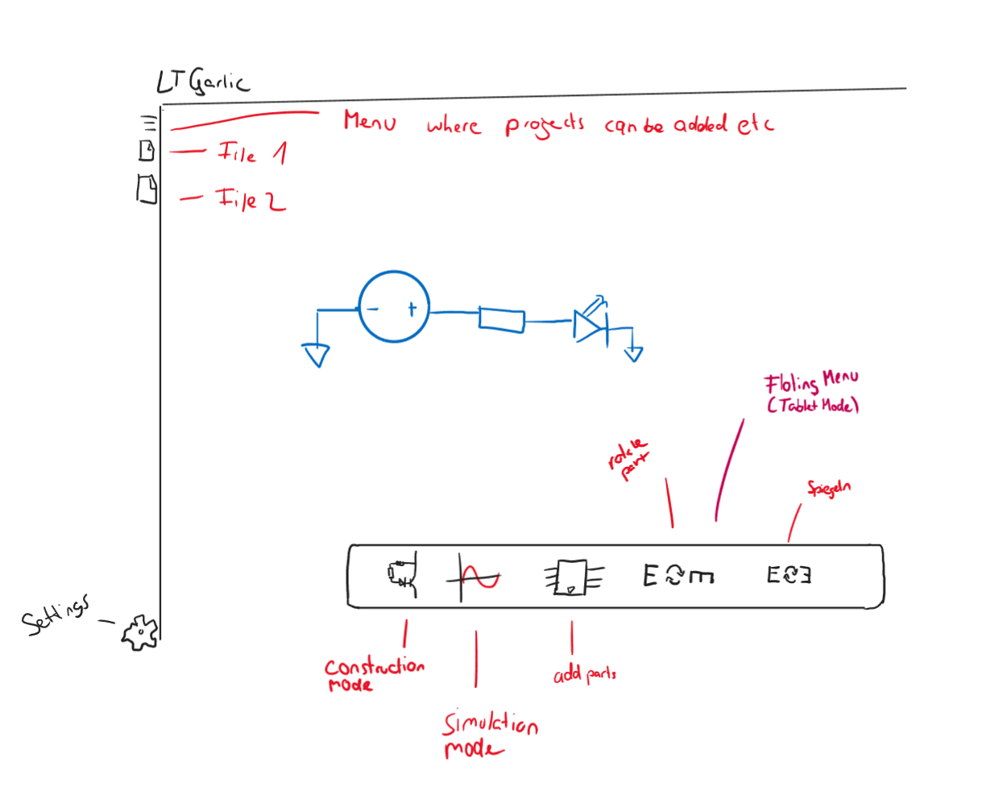
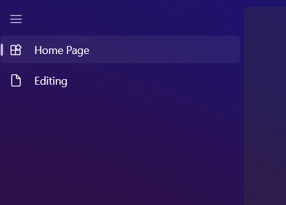
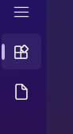

This is LTGarlic...

LTGarlic is a alternative Spice Simulator themed around Windows's SDK for Windows 11. 

***

[TOC]

***

## Idea 

The Idea of LTGarlic was to update, renew and optimize the broadly used LTSpice, hints the Name LTGarlic.

## Concept

Our first idea was to use **W**indows**P**resentation**F**oundation (*short WPF*) as a Base for our Programm, but we decided to use the more modern Windows SDK - WinUI3. We decided to use WinUI3 instead of WPF because of the clear benifits for our specific Application: WPF is an older "discontinued" SDK, which uses UI Elements mainly Themed in the Style of Windows 7. It is Possible to use custom Themes in WPF but we decided that this isnt worth the hassle of going so deep into WPF, even though we have the most knowledge in WPF. 

### Concept drawings

Here you can see the first concept for the drawing area of the Programm

### WinUI3 

WinUI3 is the newest SDK from Microsoft, released with Windows 11. It supplies the Basic Windows 11 Themed UI Elements and the necessary Resources. You can choose C# or C++ for Programming in WinUI3, we have choosen C# because of our broader understanding. 

## Projectplanning

For Projectplanning we used a tool called Asana for a dynamic Gantt Diagramm, but we mainly used the issues Feature of our Gitlab Repository.

We started the Project at mid November '22 and gave us until start of January '23
currenltly we are still on time.

*** 
### Issues we faced 

#### WinUI3 related

At first we never worked with WinUI3 so we had to learn from the Ground-Up how it works and how we had to implement certain functions. 

#### WinUI doesnt have a XAML Editor 
Yes currently WinUI is lacking a very important and helpfull tool, a XAML Editor. We stumbled on a Github Issue, where the problem was noted and disccused. A user stated that it isnt 100% needed because WinUI supports hot debuging, so its possible to change the xaml during debuging with the changes live, so thats an alternative. 

***

## Features 

Currently it is possible to draw a variety of custom circuits, with the planned extention of Simulation

## How to use

***

## Technical Documentation 

### Structure 

**When you create a WinUI3 Project, some underprojects will be created:**

The .Core Project is needed for all the **Helpers** of the WinUI SDK

The .Tests.MSTest is just needed for **debugging** 

Here the main Programming for the **UI** happens. 

For the **drawing of circuits** we created a Project with files for every form of Component and the Pins and Wires.

### Functions 
This particular Programm is set up in "Pages". So there is a "Home Page" a "Editing Page" and a "Settings Page". All the UI that stays up everytime, so on every Page is in the ShellPage.xaml

So the left Hamburger Menu and the Titlebar is managed in this file. The Behaviour of the Menu is handled by the ShellPage.xaml.cs with the help of the .CORE Project. (unfolding and opening)

*opend Hamburger menu*

*closed Hamburger menu*

## Layout 

The Layout of the Programm is build up like this: you have a main "HomePage" where you can create Projects, open Projects or certain libaries. If you open or create a Project it will be added to the Menu on the left, currently represented by a Project called "Editing". There will be the possibility to change between different Projects in this Menu on the left side. If you are in a Project it should be possible to add Components and draw Wires. 

*the hotbar at the bottom of the Program, with construction mode you can draw wires. Simulation Mode will open a new Window showing a empty plot, with the coursor you will be able to probe.*

In the Future we could make the hotbar customisable with the helpof the three button menu on the right, where you could add more tools etc.

In the Settings its possible to change the default saving loaction and change the theme from dark to light or vice versa. 

