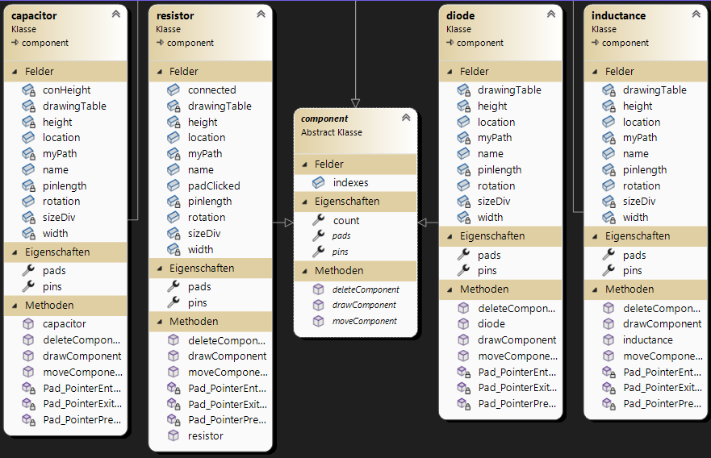
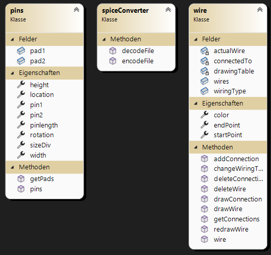
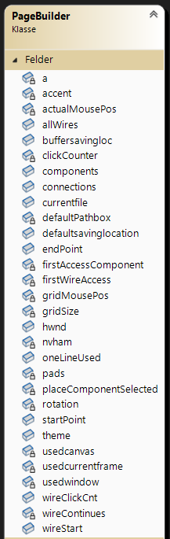
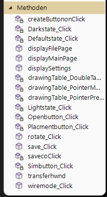
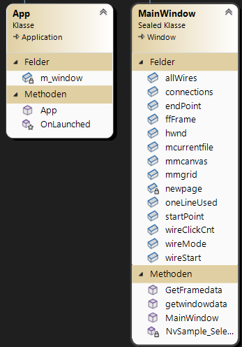
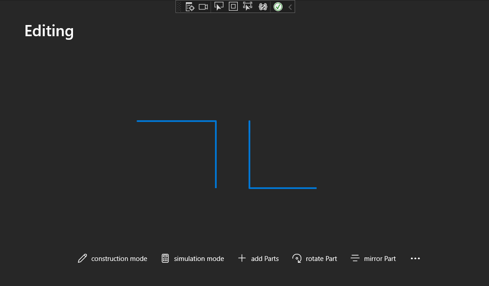

This is LTGarlic...

LTGarlic is a alternative Spice Simulator themed around Windows's SDK for Windows 11. 

***

[TOC]

***

## Idea 

The Idea of LTGarlic was to update, renew and optimize the broadly used LTSpice, hence the name LTGarlic.

## Concept

Our first idea was to use **W**indows**P**resentation**F**oundation (*short WPF*) as a Base for our Programm, but we decided to use the more modern Windows SDK - WinUI3. We decided to use WinUI3 instead of WPF because of the clear benifits for our specific application: WPF is an older "discontinued" SDK, which uses UI elements mainly themed in the style of Windows 7. It is possible to use custom themes in WPF but we decided that this wasn't worth the hassle of going so deep into WPF, even though we are more familiar with the usage of WPF. 

### Concept drawings

Here you can see the first concept for the drawing area of the Programm

### WinUI3 

WinUI3 is the newest SDK from Microsoft, released with Windows 11. It supplies the basic Windows 11 themed UI elements and the necessary resources. You can choose C# or C++ for programming in WinUI3, we have choosen C# because of our broader understanding of the language. 

---

## Projectplanning

For Projectplanning we used a tool called "Asana" for a dynamic Gantt Diagramm, but we mainly used the issues feature of our Gitlab Repository.

We started the project mid November '22 and set our deadline to January '23.
currently we are still on time.

### Issues we faced 

#### WinUI3 related

At first we never worked with WinUI3 so we had to learn from the ground-up how it works and how we had to implement certain functions. 

#### WinUI doesnt have a XAML Editor 
Currently WinUI is lacking a very important and helpful tool, a XAML Editor. We stumbled on a Github-issue, where the problem was noted and discussed. A user stated that it isnt 100% needed because WinUI supports hot debugging, so its possible to change the xaml during debugging with the changes live, so thats an alternative. 

#### adding Pages errors
At first we used the [Template Studio](https://marketplace.visualstudio.com/items?itemName=TemplateStudio.TemplateStudioForWinUICs) to create the basic outline of our Project, that worked and looked great at first, but as we tried to add our own pages via a function we hit a roadblock. At first you have to understand how WinUi3 creates programs. WinUI3 uses the [NVVM Model](https://en.wikipedia.org/wiki/Model%E2%80%93view%E2%80%93viewmodel) and the Project was combined like this: 

![[oldstructure.png]]

The whole page, so the base where everything else is combined, is the ShellPage, it contains a NavigationView. The Framework links the right content-area to files such as *EditingPage.xaml* or *MainHomePage.xaml* standing for the page where you can edit and create a schemetic, and the HomePage, where you can start or open a new project retrospectively. And here we had a Problem, we wanted to create a new item in the NavigationView hamburger menu on the left, so we can add new projects with tabs. But at first we needed to understand how all of this was binded etc. This took a huge amount of time because of the complex nature of the created application. But we got to the point where we could add new pages in the NavigationView so the hamburger menu on the left, but the 
~~~ cs
App.GetService<ShellPage>(); 
~~~
just crashes the whole ShellPage. We tried alot of other ideas to add pages but none of them worked correctly.

So we changed to a new completly blank Project last minute, where we added all of the concepts ourselves.

***

## Features 

Currently it is possible to draw a variety of custom circuits, with the planned extention of Simulation

## How to use

***

## Technical Documentation 

### Structure 
The class diagram was too large to fit in one clear screenshot, so a few seperate screenshots have been taken.

#### components folder

#### Miscellaneous folder + spiceConverter

#### PageBuilder fields

#### PageBuilder methods

#### other

### Functions 
This particular program is set up in "pages". So there is a "Home Page" an "Editing Page" and a "Settings Page". All of the UI that stays up everytime, so on every Page is in the ShellPage.xaml

So the left hamburger menu and the titlebar is managed in this file. The behaviour of the menu is handled by the ShellPage.xaml.cs with the help of the .CORE project. (unfolding and opening)

*opened hamburger menu*

*closed hamburger menu*

#### components
At the moment, there are four different components to choose from (diode, resistor, capacitor, inductance). Later, components could be added using LTspice-libraries.

##### Components folder
The abstract class component is the parent-class of all the components, which are being used. It contains the basic methods which are being used:

~~~cs
public abstract void drawComponent(Point location, int rotation, SolidColorBrush color);

public abstract void deleteComponent();

public abstract void moveComponent(Point location, int rotation, SolidColorBrush color);
~~~

- The drawComponent method takes a location, rotation and color as parameters. It is responsible for drawing the selected component, using the specified parameters, and storing the positions of its pins.
- The deleteComponent method removes the component from the canvas.
- The moveComponent method takes a location, rotation and color as parameters. It deletes the component first and draws it again afterwards, mostly at a different position.

#### wiring
The wire class enables the user to draw and delete wires. The constructor of the wire contains the Canvas, in which the wire will be drawn.
The most important methods are the following ones:

~~~cs
public void drawWire(Point startPoint, Point endPoint, SolidColorBrush color)

public void deleteWire()

public void redrawWire()

public void changeWiringType()
~~~

 - The drawWire method accepts a start- and endpoint, as well as a color. It then draws a line with the specified characteristics to the canvas, which has been given in the constructor of the class.
 - The deleteWire method deletes the specified wire from the canvas.
 - The redrawWire method deletes the wire and draws it again afterwards.
 - the changeWiringType changes how the wire is drawn. If the desired wire isn't horizontal or vertical, two lines are drawn to the canvas. The wiringType defines, if the horizontal line is drawn first, or the vertical line. The image below displays the two different wiring types.

Note: In the current version, the wiring has some bugs, which will be addressed in later versions.

#### de/encoding
##### encoding
A big feature of LTgarlic is the ability to save the files you were working on as .asc files. These can be opened by LTspice without problems.

##### decoding
LTSpice (.asc)-Files can be opened by LTgarlic. This means, if someone has been working with LTspice recently, he/she can easily switch to LTgarlic if the desire came up, which makes the program a more attractive option as an alternative to LTspice.

##### spiceConverter
The spiceConverter class is a static class, which contains the following static methods:

~~~cs
encodeFile(string filelocation)

decodeFile(Canvas canvas, string path)
~~~

 - The encodeFile method takes the file location (where the file will be saved) as a parameter. It converts the positions, rotations, etc. of components and wires and converts it to an LTspice-compilable format. It will be saved as a .asc file.
 - The decodeFile method takes a canvas and a path as parameters. It splits the LTspice-file into substrings and extracts information like component name, position, rotation, type, etc. and applies it to a new file, which will be opened in LTgarlic. At the moment this method has some bugs which will be fixed in later versions.
## Layout 

The Layout of the Programm is build up like this: you have a main "HomePage" where you can create Projects, open Projects or certain libaries. If you open or create a Project it will be added to the Menu on the left, currently represented by a Project called "Editing". There will be the possibility to change between different Projects in this Menu on the left side. If you are in a Project it should be possible to add Components and draw Wires. 

*the hotbar at the bottom of the Program, with construction mode you can draw wires. Simulation Mode will open a new Window showing a empty plot, with the coursor you will be able to probe.*

In the Future we could make the hotbar customisable with the helpof the three button menu on the right, where you could add more tools etc.

In the Settings its possible to change the default saving loaction and change the theme from dark to light or vice versa. 

